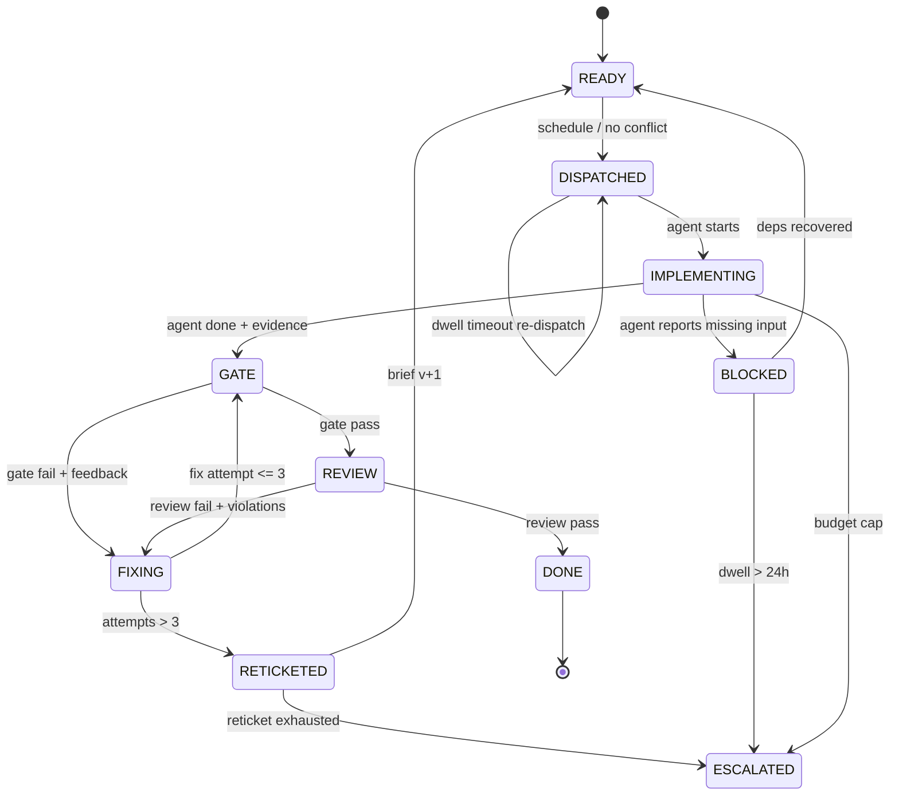

# Ticket-Ledger State Machine — Campaign Execution Rails

> Status: Authoritative execution design for the `engine-unification` campaign (and reusable for later campaigns).
> Companion artifacts: `campaigns/engine-unification/orchestrator/ticket-machine.workflow.js` (executable), `campaigns/engine-unification/orchestrator/gate_runner.py` (gate executor), `design_drafts/BACKTEST-DESIGN.md`.

## 1. Principles

1. **The ledger is the only truth.** Every transition is appended to an append-only JSONL event log. A crashed machine resumes by replaying the ledger — no in-memory state is authoritative.
2. **One state machine per ticket, one scheduler for all.** Tickets run in parallel subagents; the scheduler only enforces the rails below.
3. **Gates are code, not judgment.** A gate is a shell command list copied verbatim from the ticket's `## Acceptance` section, executed hermetically (tmpdir, fixed env, no GPU unless the ticket declares `integration: true`).
4. **Review is a second gate, not a formality.** A reviewer subagent checks the diff against the ticket's declared file scope and the project Do-NOT rules.
5. **Bounded loops.** Every retry loop has a hard counter. Nothing loops forever; persistent failure escalates to a human-visible terminal state.

## 2. Ticket Lifecycle States

```
                ┌────────────────────────────────────────────┐
                v                                            │ (reticket v+1)
READY ──> DISPATCHED ──> IMPLEMENTING ──> GATE ──> REVIEW ──> DONE
   ^                        │            │  ^        │
   │                        │      fail  v  │  fail  │
   │                        │          FIXING ┘        │
   │                        │            │ attempts>3  │
   │                        │            v             │
   │                        └──> BLOCKED       RETICKETED
   │                                     \\
   │                                      ESCALATED (terminal, human)
```

| State | Meaning | Owner | Max dwell |
|---|---|---|---|
| `READY` | All `blockedBy` tickets are `DONE`; file-ownership check passed | Scheduler | — |
| `DISPATCHED` | Subagent spawned with the brief + rails preamble | Scheduler | 5 min to first event, else re-dispatch |
| `IMPLEMENTING` | Agent is writing code | Subagent | Budget cap (per-ticket token/time limit) |
| `GATE` | `gate_runner.py` executes Acceptance commands hermetically | Machine | 10 min |
| `REVIEW` | Reviewer subagent audits diff vs scope + Do-NOT rules | Reviewer agent | 10 min |
| `FIXING` | Same agent (or fresh agent) receives structured failure feedback | Subagent | 3 attempts max |
| `RETICKETED` | 3 failed fix attempts → brief rewritten (v+1), scope narrowed or split | Planner agent | — |
| `BLOCKED` | A dependency failed or a missing input was discovered | Machine | 24h max, then ESCALATED |
| `ESCALATED` | Terminal. Human handoff packet written to evidence | Machine | — |
| `DONE` | Gate passed + review passed + evidence recorded | — | — |

## 3. Transition Rules (exact)

| From | Event | To | Guard / Action |
|---|---|---|---|
| READY | schedule | DISPATCHED | fan-out cap not exceeded; no file-ownership conflict with any in-flight ticket; ledger append `DISPATCHED` |
| DISPATCHED | agent starts | IMPLEMENTING | preamble delivered (brief, rails, evidence path) |
| IMPLEMENTING | agent reports done | GATE | agent must have written evidence summary; machine extracts `## Acceptance` commands |
| GATE | all commands exit 0 | REVIEW | ledger append `GATE_PASS` with output hash |
| GATE | any command fails | FIXING | feedback = failing command + stderr tail (max 100 lines) + relevant brief section |
| REVIEW | verdict PASS | DONE | ledger append `DONE` with diff hash, files-touched list |
| REVIEW | verdict FAIL(scope/rules) | FIXING | feedback = specific violations, quoted rule |
| FIXING | fix attempt n | GATE | attempt counter incremented; n ≤ 3 |
| FIXING | attempt > 3 | RETICKETED | failure digest written to evidence; planner rewrites brief |
| RETICKETED | brief v+1 ready | READY | new brief file `Txx.md` replaced, ledger notes revision |
| RETICKETED | reticket exhausted (brief rewrite fails) | ESCALATED | handoff packet: failure digest, recommendation |
| any | dep failed / input missing | BLOCKED | re-evaluated on every ledger event |
| BLOCKED | dwell > 24h with no dep recovery | ESCALATED | handoff packet: blocked dependency, evidence |
| DISPATCHED | no first event in dwell | DISPATCHED | idempotent re-dispatch (agent output is harmless if duplicated — gate decides) |
| any | budget cap hit without DONE | ESCALATED | handoff packet: state, attempts, evidence links |

**Terminal/absorbing states:** `DONE`, `ESCALATED`. **All other states are recoverable by ledger replay.**

## 4. Per-Ticket Rails (preamble injected into every subagent)

1. Work only inside the files listed in the brief. Touching any other file = review FAIL.
2. Never modify `benchmark-results.db`; engine data goes to `engine.db` only (Rule 6).
3. Never invent an API. Every symbol you call must have its signature in the brief. If something is missing, STOP and report `BLOCKED: <what>` — that is a valid outcome, not a failure.
4. On completion, write the evidence file (Deliverable path): what you built, the acceptance commands you ran, their output tails.
5. Budget: you have one implementation pass; do not self-review endlessly. The machine tests you.
6. No new pip dependencies. Standard library only unless the brief says otherwise.

## 5. Gate Rails (`gate_runner.py`)

- Extracts the `## Acceptance` section commands from the brief; runs each with `bash -c`, cwd = repo root, 10 min timeout each, scrubbed env (`ENGINE_TOKEN` etc. injected only for `integration: true` tickets).
- Hermetic: passes a temp workspace for file-creating tests; refuses commands matching `rm -rf /`, `pip install`, `docker` (except sandbox-designated tickets).
- Output: JSON verdict `{ticket, attempt, commands: [{cmd, exit, tail}], pass, gate_hash}` appended to the ledger.
- **Gate hash** = sha256 of (brief revision + command outputs) — the atom identity used by backtesting.

## 6. Review Rails (reviewer subagent checklist)

1. `git diff --name-only` ⊆ brief's declared file scope.
2. Do-NOT section of the brief: zero violations.
3. No invented APIs: every non-stdlib import resolves to a file in scope or a file listed in Context.
4. Brief acceptance commands actually appear in the agent's evidence (not fabricated).
5. Verdict JSON: `{ticket, pass, violations: [{rule, evidence}]}`.

## 7. Parallel Scheduling

- **Wave = parallel group** from `WAVEPLAN.json`; within a wave, tickets dispatch as fan-out allows (cap 4 concurrent implement agents, 2 concurrent reviewers).
- **File-ownership check** before dispatch: parse each brief's declared files; if two in-flight tickets own the same file, serialize them (the second waits) — prevents merge conflicts by construction.
- **No cross-wave speculation**: a wave starts only when its `needs` waves are all-DONE.

## 8. Ledger Format (`evidence/ledger.jsonl`, append-only)

```json
{"ts": "...", "ticket": "T25", "from": "READY", "to": "DISPATCHED", "agent": "a-123", "attempt": 1}
{"ts": "...", "ticket": "T25", "from": "GATE", "to": "REVIEW", "gate_hash": "...", "attempt": 1}
{"ts": "...", "ticket": "T25", "from": "REVIEW", "to": "DONE", "files": ["engine/generator.py"], "diff_hash": "..."}
```

Resume rule: on machine start, replay ledger → derive current state per ticket → dispatch only tickets whose state is `READY` or that need re-dispatch. Replay is idempotent.

## 9. What Was Missing From the Original Ask (plugged blind spots)

1. **Escalation instead of infinite loops** — RETICKETED/ESCALATED terminal paths (asked-for loop-back had no exit).
2. **File-ownership serialization** — parallel agents editing the same file was the unaddressed failure mode of "run in parallel".
3. **Idempotent crash-resume** — a parallel machine without ledger replay loses in-flight work on crash.
4. **Gates as hermetic code** — otherwise a passing gate is not reproducible and backtesting (see BACKTEST-DESIGN.md) is impossible.
5. **Scope-guard at review** — a small model left unchecked edits files outside its brief; the diff-scope check catches it mechanically.
6. **Dwell-time watchdogs** — hung subagents (state DISPATCHED/IMPLEMENTING beyond cap) are re-dispatched or escalated.
7. **Budget caps per state** — token/time limits stop a 9B model from thrashing inside one state.
8. **BLOCKED as a first-class outcome** — small models must be able to say "I lack X" without being punished; blocked tickets re-evaluate automatically.

## 10. Mermaid (canonical)


